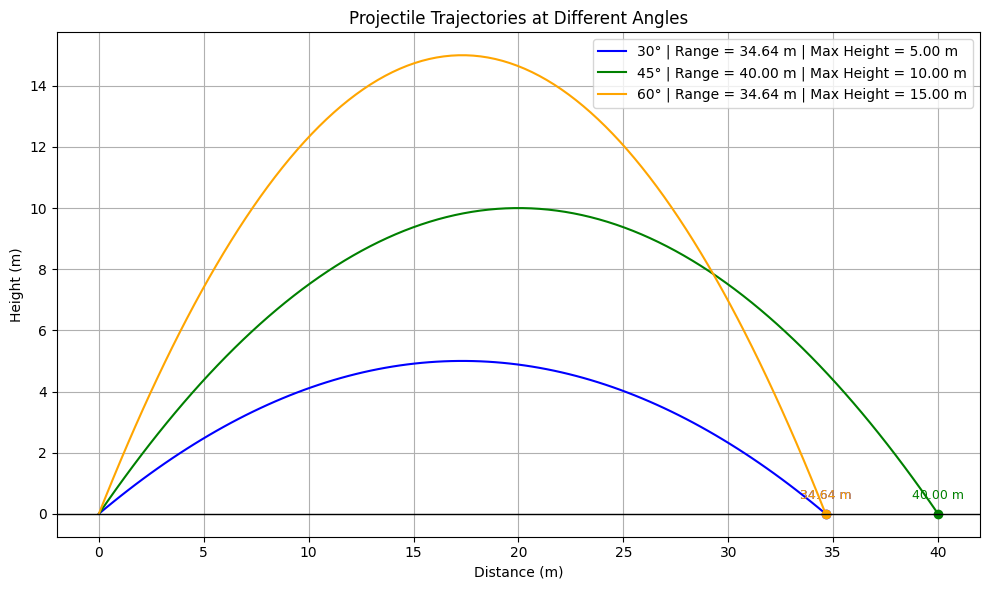

# Problem 1
# Investigating the Range as a Function of the Angle of Projection


## Introduction and Motivation

Projectile motion is crucial in fields like sports, engineering, and defense. Understanding how launch angles affect range helps optimize performance in activities like basketball and javelin throwing, and informs designs in aerospace applications.
 
## Differential Equation for Range as a Function of Angle

The motion of a projectile launched at speed \($v_0$ \) and angle \( $\theta$ \) is governed by:

### **Equations of Motion**
- **Horizontal:**  
  $$
  \frac{d^2 x}{dt^2} = 0 \quad \Rightarrow \quad x(t) = v_0 \cos{\theta} \cdot t
  $$  
- **Vertical:**  
  $$
  \frac{d^2 y}{dt^2} = -g \quad \Rightarrow \quad y(t) = v_0 \sin{\theta} \cdot t - \frac{1}{2} g t^2
  $$

### **Range Equation**
At ($y = 0$ )


## Theoretical Foundation 
 Projectile motion follows Newton’s laws, with **horizontal motion** at constant velocity and **vertical motion** under gravity. The **range** depends on **initial velocity** and **angle of projection**, derived from kinematic equations.

 The key variables are: 
 
 * Initial velocity ($v0$)
 * Angle of projection ($θ$)
 * Gravitational acceleration ($g$)

The **range formula** is: 

$$R = \frac{v_0^2 \sin(2\theta)}{g}$$

## Range And Analysis
* Range is **maximized at 45°** in ideal conditions because the optimal angle of 45° strikes a balance between maximizing the time of flight (due to vertical velocity) and maintaining a large horizontal velocity, which leads to the maximum range in ideal conditions

* Real-world factors like **air resistance**, **gravity variations**, and **terrain** require computational simulations for accuracy. 

* Higher velocity increases range, and lower gravity extends it, making this study crucial for sports, engineering, and aerospace applications.

## Practical Applications  

* Projectile motion is crucial in **sports**, where athletes optimize angles for maximum range (e.g., soccer, basketball, javelin).  

* In **military and defense**, accurate trajectory calculations improve targeting for artillery and missiles.  

* In **aerospace and engineering**, projectile principles guide rocket launches, spacecraft trajectories, and planetary landings, requiring computational simulations for precision.  


## Calculating Range at Different Angles  

Using the **range formula**:  

$$
R = \frac{v_0^2 \sin(2\theta)}{g}
$$

Projectile range for angles **35°** and **45°**, with an initial velocity of **20 m/s** and gravity **\( g = 10 \) m/s²**.  

#### Example 1: **Angle = 35°**  

$$
R = \frac{20^2 \sin(70°)}{10}
$$

$$
R = \frac{400 \times 0.9397}{10}
$$

$$
R = \frac{375.88}{10} = 37.6 \text{ m}
$$

#### Example 2: **Angle = 45°** (Optimal Angle)  

$$
R = \frac{20^2 \sin(90°)}{10}
$$

$$
R = \frac{400 \times 1}{10}
$$

$$
R = \frac{400}{10} = 40 \text{ m}
$$

#### Example 3: **Angle = 60°**  

$$
R = \frac{20^2 \sin(120°)}{10}
$$

$$
R = \frac{400 \times \sin(120°)}{10}
$$

$$
R = \frac{400 \times 0.866}{10}
$$

$$
R = \frac{346.4}{10} = 34.64 \text{ m}
$$

These results show that **45° gives the maximum range**, while **35° has a slightly shorter range**.


### Python script to compute and plot the range 

```python
import numpy as np
import matplotlib.pyplot as plt

# Constants
g = 10  # gravity (m/s²)
v0 = 20  # initial velocity (m/s)
angles = [30, 45, 60]  # angles in degrees
colors = ['blue', 'green', 'orange']

plt.figure(figsize=(10, 6))

for angle, color in zip(angles, colors):
    angle_rad = np.radians(angle)
    
    # Time of flight
    t_flight = 2 * v0 * np.sin(angle_rad) / g
    t = np.linspace(0, t_flight, num=100)
    
    # Trajectory
    x = v0 * np.cos(angle_rad) * t
    y = v0 * np.sin(angle_rad) * t - 0.5 * g * t**2
    
    # Max height
    max_height = (v0**2 * np.sin(angle_rad)**2) / (2 * g)
    
    # Plot trajectory
    plt.plot(x, y, label=f"{angle}° | Range = {x[-1]:.2f} m | Max Height = {max_height:.2f} m", color=color)
    
    # Annotate range point
    plt.plot(x[-1], 0, 'o', color=color)
    plt.text(x[-1], 0.5, f"{x[-1]:.2f} m", ha='center', fontsize=9, color=color)

# Labels and grid
plt.title("Projectile Trajectories at Different Angles")
plt.xlabel("Distance (m)")
plt.ylabel("Height (m)")
plt.grid(True)
plt.legend()
plt.axhline(0, color='black', linewidth=1)
plt.tight_layout()
plt.show()
```


## Conclusion

This study demonstrates that the range of a projectile is significantly influenced by the launch angle, with **45°** yielding the maximum range under ideal conditions. By exploring projectile motion through theoretical calculations and visualizations, we gain valuable insights applicable to sports, engineering, and defense. While the model assumes ideal conditions, real-world factors such as air resistance and terrain can alter the trajectory. Future studies could expand on this by incorporating these factors for more accurate predictions.

## Source
[Colab Python Computation](https://colab.research.google.com/drive/1tRIRwlVz-um7t8zBhD_DcY86myED9WIK?usp=sharing)