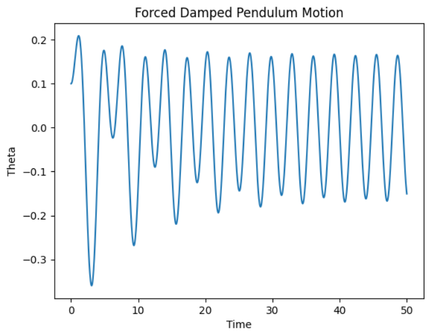

# Problem 2
# Investigating the Dynamics of a Forced Damped Pendulum
## 1. Theoretical Foundation

The motion of a forced damped pendulum follows:

$$
\ddot{\theta} + b \dot{\theta} + c \sin{\theta} = A \cos{(\omega t)}
$$

For small angles, $\sin{\theta} \approx \theta$, simplifying to:

$$
\ddot{\theta} + b \dot{\theta} + c \theta = A \cos{(\omega t)}
$$

### Solution

The homogeneous solution:

$$
\theta_h (t) = e^{-\frac{b}{2} t} (C_1 \cos{\omega_0 t} + C_2 \sin{\omega_0 t})
$$

where $\omega_0 = \sqrt{c - \frac{b^2}{4}}$.

For forced motion:

$$
\theta_p (t) = \frac{A}{\sqrt{(c - \omega^2)^2 + b^2 \omega^2}} \cos{(\omega t - \delta)}
$$

with $\tan{\delta} = \frac{b \omega}{c - \omega^2}$.

### Resonance

Resonance occurs when:

$$
\omega_r \approx \sqrt{c}
$$

leading to maximum oscillation amplitude.

## 2. Analysis of Dynamics

The motion of the forced damped pendulum depends on three key parameters:

- **Damping coefficient ($b$):** Higher damping reduces oscillations, leading to overdamped, underdamped, or critically damped motion.
- **Driving amplitude ($A$):** Controls the energy input, influencing the transition between periodic, quasiperiodic, and chaotic motion.
- **Driving frequency ($\omega$):** Determines resonance conditions and phase synchronization.

### Regular vs. Chaotic Motion

- **Low driving force & damping:** The system exhibits periodic or quasiperiodic motion.
- **High driving force & low damping:** The pendulum transitions to **chaotic motion**, where small changes in initial conditions lead to vastly different outcomes.
- **Poincaré sections & bifurcation diagrams** help visualize transitions from order to chaos.

### Physical Interpretations

- **Energy Transfer:** Damping dissipates energy, while external forcing replenishes it.
- **Synchronization:** At specific $\omega$, the pendulum locks into phase with the driving force.
- **Chaotic Behavior:** Sensitive dependence on initial conditions, leading to unpredictable long-term motion.

These dynamics apply to systems like suspension bridges, oscillating circuits, and climate models.

## 3. Practical Applications

The forced damped pendulum model applies to various real-world systems, including:

### **1. Energy Harvesting**  
- Used in **vibration energy harvesters** to convert mechanical oscillations into electrical power.  
- Example: Piezoelectric systems that harness ambient vibrations.

### **2. Suspension Bridges & Structural Engineering**  
- Explains **resonance-induced failures**, such as the **Tacoma Narrows Bridge collapse**.  
- Helps design damping mechanisms to prevent destructive oscillations.

### **3. Oscillating Circuits**  
- Analogous to **driven RLC circuits**, where voltage and current oscillate under an external AC source.  
- Used in **radio tuning** and **signal processing**.

### **4. Biomechanics & Robotics**  
- Models **human gait** and walking stability under external forces.  
- Helps in designing **prosthetics** and **robotic locomotion**.

### **5. Climate & Planetary Motion**  
- Describes **quasiperiodic variations** in planetary orbits.  
- Used in models of **climate oscillations** influenced by external periodic forces.

These applications highlight the model’s significance across physics, engineering, and biological systems.

## 4. Implementation

To analyze the forced damped pendulum, a computational model is required. The following steps outline the implementation:

### **1. Numerical Simulation**
- Solve the differential equation:

  $$\ddot{\theta} + b \dot{\theta} + c \sin{\theta} = A \cos{(\omega t)}$$

- Use **Runge-Kutta methods** for numerical integration.
- Simulate motion under different damping, forcing, and initial conditions.

### **2. Visualization**
- **Time Series Plots:** Show angular displacement over time.
- **Phase Portraits:** Plot $\dot{\theta}$ vs. $\theta$ to reveal stability and chaos.
- **Poincaré Sections:** Sample phase space at regular intervals to detect periodicity.
- **Bifurcation Diagrams:** Track changes in behavior as parameters vary.

### Example snippet:

```python
from scipy.integrate import solve_ivp
import numpy as np
import matplotlib.pyplot as plt

def pendulum(t, y, b, c, A, omega):
    theta, omega_dot = y
    return [omega_dot, -b * omega_dot - c * np.sin(theta) + A * np.cos(omega * t)]

# Parameters
b, c, A, omega = 0.2, 1.0, 0.5, 2.0
t_span = (0, 50)
y0 = [0.1, 0]

sol = solve_ivp(pendulum, t_span, y0, args=(b, c, A, omega), t_eval=np.linspace(0, 50, 1000))

# Plot results
plt.plot(sol.t, sol.y[0])
plt.xlabel("Time")
plt.ylabel("Theta")
plt.title("Forced Damped Pendulum Motion")
plt.show()
```


## Source
## [Link to Colab](https://colab.research.google.com/drive/1mIRd9KSWpGVR9i_TpfusD-mv2_rJlp-U)
